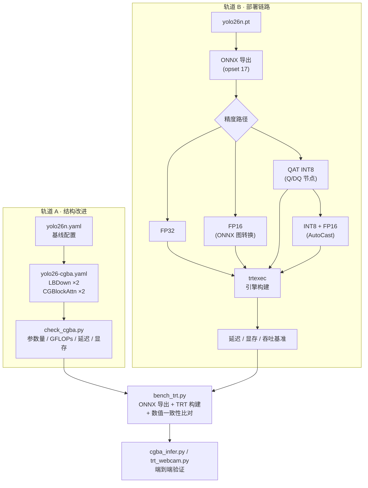

# 面向无人机航拍小目标检测的 YOLO26 结构改进与 TensorRT 部署代价评估

**Structural Modification of YOLO26 and Deployment Cost Evaluation on TensorRT 11 for UAV Aerial Small-Object Detection**

---

| 项目         | 说明                                                          |
| ------------ | ------------------------------------------------------------- |
| **课题方向** | 无人机航拍场景下的小目标检测                                  |
| **基础框架** | Ultralytics YOLO26n（`ultralytics 8.4.143`）                  |
| **改进内容** | `LBDown`（可学习双边下采样）、`CGBlockAttn`（粗粒度块注意力） |
| **部署目标** | NVIDIA TensorRT 11 强类型网络                                 |
| **评估维度** | 结构开销、推理延迟、显存占用、数值一致性                      |
| **实验平台** | NVIDIA GeForce RTX 4060 Laptop (8 GB, Ada, sm_89) / WSL2      |
| **文档版本** | v1.0 · 2026-09                                                |

---

## 摘要

本工作报告了在 YOLO26n 检测框架上开展的两项相互独立、又可在同一系统中协同验证的工作。

**在结构改进方面**，针对无人机航拍场景中目标像素占比小、降采样过程易造成响应衰减的问题，本文提出并实现了两个模块：`LBDown`（Learnable Bilateral Downsampling，可学习双边下采样）以可学习的加权采样替代 backbone 前两级固定 stride-2 卷积；`CGBlockAttn`（Coarse-Grained Block Attention，粗粒度块注意力）在 P3/P4 特征层以粗粒度 token 实现低算力的跨区域上下文建模。二者共同使模型参数量增加 3.8%、理论计算量（GFLOPs）增加 15.0%。

**在部署方面**，本工作完整打通了 PyTorch → ONNX → TensorRT 11 的转换链路，覆盖 FP32、FP16、量化感知训练（QAT）INT8 与 INT8+FP16 混合精度四条精度路径。

**主要实验发现**如下：

1. **理论计算量不能预测部署延迟。** 结构改进仅增加 15.0% GFLOPs，实测延迟却增加 39.2%（PyTorch）/ 41.0%（TensorRT fp32）。性能瓶颈位于 `GridSample` 等访存密集型算子，而非计算量本身。
2. **部分量化条件下，INT8 精度不一定优于 FP16。** 在本实验的 QAT 配置中，仅 38%（78/207）的卷积层被量化，其余层维持 FP32，由此引入的 INT8↔FP32 格式转换开销使 INT8 引擎的延迟反而高于 FP16 引擎约 12%–16%。
3. **TensorRT 11 的 Python 绑定存在显著的逐次调用开销。** 实测 `IExecutionContext::execute_async_v3` 的单次调用开销为 3.637 ms，约为同等规模 torch CUDA kernel 入队开销（0.020 ms）的 180 倍。该开销会掩盖 GPU 真实算力，采用 CUDA Graph 捕获可将单次调用开销降至 0.016 ms。
4. **端到端帧率与引擎精度弱相关。** 在摄像头/视频处理链路中，视频解码、letterbox 预处理、NMS 后处理与绘制环节合计占总耗时的 90% 以上，引擎精度差异对端到端帧率的影响在测量噪声范围内。

> **评估范围声明**
> 本工作聚焦于**结构代价与部署代价的定量刻画**。由于缺少与目标场景匹配的航拍标注数据集，本工作**不包含精度（mAP / Recall / F1）评估**，亦未开展训练与结构消融实验。文中所有数据均限定于**计算开销、延迟、显存与数值一致性**四类范畴，不复现、不引用任何精度指标。

---

## 目录

1. [引言](#1-引言)
2. [系统总体设计](#2-系统总体设计)
3. [方法一：结构改进](#3-方法一结构改进)
4. [方法二：TensorRT 部署](#4-方法二tensorrt-部署)
5. [实验设置](#5-实验设置)
6. [结果与分析](#6-结果与分析)
7. [讨论](#7-讨论)
8. [局限性与有效性威胁](#8-局限性与有效性威胁)
9. [复现指南](#9-复现指南)
10. [附录](#10-附录)
11. [参考文献](#11-参考文献)

---

## 1 引言

### 1.1 研究背景

无人机航拍目标检测在交通监控、灾害评估、农业普查等场景中具有广泛应用需求，但其视觉特征与通用检测基准存在显著差异，主要体现为两方面困难：

**（1）目标尺度极小。** 在典型航拍高度下，车辆、行人等目标的成像尺寸往往仅十余像素。标准主干网络中连续的 stride-2 降采样操作会通过固定窗口聚合的方式削弱此类小目标的响应强度，造成特征在深层网络中趋于消失。

**（2）目标分布密集，且依赖长程上下文。** 航拍图像中目标常成片聚集，类别判别往往需要跨区域的空间关系（如停车区域内的车辆与道路结构）。然而标准卷积的感受野增长速率有限，深层网络的上下文建模能力相对不足。

近年来，视觉 Transformer 及其变体通过自注意力机制显著提升了长程建模能力，但其计算复杂度随特征图分辨率呈二次增长，直接应用于高分辨率航拍场景的算力代价难以接受。因此，**如何在有限算力预算内同时缓解小目标响应衰减与长程上下文缺失，并在真实推理后端上量化其代价**，是本章关注的核心问题。

### 1.2 问题定义

本工作不从精度角度求解上述问题，而是将问题形式化为一个**代价评估问题**：给定一组针对航拍小目标场景设计的结构改进，需要回答

1. 该改进在模型规模与理论计算量层面的增量是多少？
2. 该增量在真实推理后端（TensorRT）上的延迟代价是多少，是否与理论计算量增量一致？
3. 引入的非标准算子（如 `GridSample`）在推理后端上的可部署性如何，是否引入额外的数值偏差？
4. 在量化部署路径上，该结构改进与量化策略如何相互影响？

### 1.3 本文贡献

1. **提出两个面向航拍小目标的结构模块并完成工程集成。** `LBDown` 以可学习的双边加权采样替代固定 stride-2 卷积；`CGBlockAttn` 以粗粒度块池化降低自注意力的 token 规模。二者均完成框架级注册与网络配置重映射（详见第 3 节）。
2. **建立完整的 PyTorch → ONNX → TensorRT 11 部署链路**，覆盖四条精度路径，并给出 TensorRT 11 强类型网络约束下的精度实现方法论（详见第 4 节）。
3. **给出多维度、可复现的代价量化结果**，包含结构开销、TensorRT 延迟、数值一致性、量化形态分析，并给出与理论计算量的对比（详见第 6 节）。
4. **揭示三项反直觉的部署工程事实**：理论 FLOPs 与延迟的脱耦、部分量化下 INT8 相对 FP16 的性能退化、以及 TensorRT 11 Python 绑定的调用开销问题（详见第 6.6 节与第 7 节）。

---

## 2 系统总体设计

### 2.1 双轨结构

本工作包含两条可独立验证、又共享同一套代码与环境的轨道。

**轨道 A — 结构改进。** 以 YOLO26n 为基线，替换浅层降采样方式并在 P3/P4 层引入粗粒度注意力，产出改进后的网络配置 `yolo26-cgba.yaml`。

**轨道 B — 部署链路。** 以原始 YOLO26n 为载体，打通 ONNX 导出、精度转换、TensorRT 引擎构建与量化感知训练全流程，产出可复用的部署方法论与基准工具链。

两条轨道的衔接点在于：**轨道 A 产出的非标准算子（`GridSample`）必须经过轨道 B 的可部署性与数值一致性验证**，否则结构改进不具备工程可行性。

### 2.2 图 1：系统流程图



---

## 3 方法一：结构改进

### 3.1 `LBDown` — 可学习双边下采样

#### 3.1.1 设计动机

标准 stride-2 卷积以固定权重对 2×2 邻域求和，其低通特性会对小目标的高频响应产生不可逆削弱。双边滤波（Bilateral Filter）的思想是：在加权聚合时同时考虑**空间邻近度**与**强度相似度**，从而在平滑的同时保留边缘。本模块将该思想参数化为可学习形式，并用于下采样。

#### 3.1.2 形式化描述

给定输入特征图 $x \in \mathbb{R}^{c_1 \times H \times W}$，定义 2×2 下采样窗口内的四个基准采样位置

$$
\mathcal{B} = \left\{ (-0.5,-0.5),\ (-0.5,0.5),\ (0.5,-0.5),\ (0.5,0.5) \right\}
$$

对每个基准位置 $k$，采样点位置由预测的亚像素偏移修正：

$$
p_k = \mathcal{B}_k + \tanh\!\left(\Delta_k(x)\right) \cdot s, \qquad s = 0.5
$$

其中 $\Delta_k(x)$ 由单个 $3\times3$ 卷积预测（输出通道数为 8，对应 4 个位置的 2 个坐标分量）。

强度响应由 $1\times1$ 卷积与 Sigmoid 激活给出：

$$
g(x) = \sigma\!\left(\mathrm{Conv}_{1\times1}(x)\right)
$$

在采样点处的取值记为 $g_k$。最终的聚合权重为**可学习空间先验**与**强度相似度**的乘积：

$$
w_k = \mathrm{softplus}(\theta_k) \cdot \exp\!\left(-\frac{(g_k - g_c)^2}{2\sigma^2}\right)
$$

其中：

- $\theta \in \mathbb{R}^{4}$ 为可学习空间先验（`spatial`）；
- $\sigma = \exp(\lambda)$，$\lambda \in \mathbb{R}$ 为可学习对数带宽（`log_sigma`）；
- $g_c$ 为窗口中心处的强度响应。

下采样结果为加权归一化后经投影层：

$$
y = \mathrm{SiLU}\!\left(\mathrm{BN}\!\left(\mathrm{Conv}_{1\times1}\!\left(\frac{\sum_{k} w_k \, x(p_k)}{\sum_{k} w_k + \epsilon}\right)\right)\right), \qquad \epsilon = 10^{-6}
$$

#### 3.1.3 实现要点

| 项目     | 实现方式                                                                            |
| -------- | ----------------------------------------------------------------------------------- |
| 可微采样 | `F.grid_sample`，`align_corners=True`、`padding_mode="border"`                      |
| 偏移取值 | 仅在窗口中心位置采样偏移图（`off[:, :, 0::2, 0::2]`），避免对全分辨率偏移图二次采样 |
| 参数量   | 少于其所替换的 stride-2 卷积（2 071 vs 5 136，减少 3 065）                          |
| 导出形态 | ONNX 中生成 `GridSample` 节点，本配置共 16 个（2 层 × 4 采样点 × 2 次采样）         |

### 3.2 `CGBlockAttn` — 粗粒度块注意力

#### 3.2.1 设计动机

标准自注意力的计算与显存复杂度为 $O(N^2)$（$N = HW$）。在航拍高分辨率特征图上直接应用代价过高。本模块通过**块级池化**将 token 数降至约 $HW / b^2$（$b$ 为块边长，默认 8），使注意力复杂度降至约 $O\!\left((HW/b^2)^2\right)$，同时通过**逐像素门控残差**将全局上下文注回全分辨率特征。

#### 3.2.2 形式化描述

给定输入 $x \in \mathbb{R}^{c \times H \times W}$（要求 $c_1 = c_2 = c$），首先通过 $1\times1$ 卷积得到查询、键、值：

$$
Q, K, V = \mathrm{Conv}_q(x),\ \mathrm{Conv}_k(x),\ \mathrm{Conv}_v(x)
$$

随后以不重叠块（尺寸 $b \times b$）对三者分别做平均池化得到粗粒度 token：

$$
\hat{Q} = \mathcal{P}_b(Q),\quad \hat{K} = \mathcal{P}_b(K),\quad \hat{V} = \mathcal{P}_b(V), \qquad \mathcal{P}_b : \mathbb{R}^{c\times H\times W} \to \mathbb{R}^{c \times \frac{H}{b} \times \frac{W}{b}}
$$

在 token 序列上执行多头自注意力（$h$ 个注意力头）：

$$
A = \mathrm{softmax}\!\left(\frac{\hat{Q}\hat{K}^{\top}}{\sqrt{d}}\right)\hat{V}
$$

将注意力输出广播回原始分辨率（最近邻上采样），经 $1\times1$ 投影后与逐像素门控相乘，并残差相加：

$$
y = x + \mathrm{Conv}_{\mathrm{proj}}(A_{\uparrow}) \odot \sigma\!\left(\mathrm{Conv}_{\mathrm{gate}}(x) + b_g\right), \qquad b_g = -2.0
$$

#### 3.2.3 关键实现决策

| 决策                                                        | 依据                                                                                                      |
| ----------------------------------------------------------- | --------------------------------------------------------------------------------------------------------- |
| **手写 `matmul + softmax`**，不调用 `nn.MultiheadAttention` | 后者的 ONNX 导出图包含动态 shape 与不支持算子，对 TensorRT 不友好                                         |
| **门控偏置初始化为 $-2.0$，投影偏置初始化为 $0$**           | 使 $\sigma(-2.0) \approx 0.119$、投影初始输出趋于零，模块在初始化时近似恒等映射，便于从预训练权重继续训练 |
| **强制约束 $c_1 = c_2$**                                    | 残差连接要求通道一致，否则构造时抛出 `ValueError`                                                         |
| **BatchNorm 置于投影之后**                                  | 归一化注意力输出分布，稳定残差分支的量级                                                                  |

### 3.3 网络配置与索引重映射

改进后的网络在 `ultralytics/cfg/models/26/yolo26-cgba.yaml` 中定义。相对官方 `yolo26.yaml` 的差异列于表 1。

**表 1 · 网络配置对照**

| 层索引           | 官方 `yolo26.yaml`    | 本工作 `yolo26-cgba.yaml` | 变更类型         |
| ---------------- | --------------------- | ------------------------- | ---------------- |
| 0                | `Conv [64, 3, 2]`     | `LBDown [64]`             | 替换             |
| 1                | `Conv [128, 3, 2]`    | `LBDown [128]`            | 替换             |
| 5                | —                     | `CGBlockAttn [512, 8, 4]` | 新增（P3 级）    |
| 8                | —                     | `CGBlockAttn [512, 8, 4]` | 新增（P4 级）    |
| head `Concat` #1 | `from = 6, 4`         | `from = 8, 5`             | 索引顺延 +2      |
| head `Concat` #2 | `from = 13, 10`       | `from = 15, 12`           | 索引顺延 +2 / +4 |
| head `Detect`    | `from = [16, 19, 22]` | `from = [18, 21, 24]`     | 索引顺延         |

> **索引重映射是本工程中最易出错的一环。** 新增层会使其后所有层索引顺延（P3 处插入层导致 +2，P4 处再插入导致 +4）。head 中每一处 `Concat` 的 `from` 字段都必须同步修正；任一遗漏都会导致通道拼接错误。该错误不会在模型构建或前向传播阶段抛出异常，而是静默产生错误的特征拼接结果。

### 3.4 框架级集成

新模块需要在框架中注册两个位置，二者缺一不可：

| 注册点             | 文件                                                        | 作用                                   |
| ------------------ | ----------------------------------------------------------- | -------------------------------------- |
| ① 模块导出         | `ultralytics/nn/modules/__init__.py`                        | 使模块类可被配置解析器检索             |
| ② **基础模块注册** | `ultralytics/nn/tasks.py` · `parse_model` 的 `base_modules` | 决定输入/输出通道推导与 width 缩放行为 |

> 若仅完成 ① 而遗漏 ②，模型可以构建并运行，但**不会参与 width 缩放**（例如 `yolo26n` / `yolo26s` 的通道系数将不生效），导致不同规模配置下的行为不一致。

---

## 4 方法二：TensorRT 部署

### 4.1 TensorRT 11 的核心约束

TensorRT 11 采用**强类型网络（strongly-typed network）**语义，取消了构建期的精度选择接口：

| TensorRT 版本 | 构建期精度控制      | 说明                                                                        |
| ------------- | ------------------- | --------------------------------------------------------------------------- |
| ≤ 10          | `--fp16` / `--int8` | 构建期可指定精度                                                            |
| **11**        | **仅剩 `--noTF32`** | `--stronglyTyped` 已废弃为 no-op；`--fp16` / `--int8` 报告 `Unknown option` |

**由此导出的关键结论**：在 TensorRT 11 下，**推理精度必须在 ONNX 导出阶段确定**，无法在引擎构建阶段调整。这一约束直接决定了整个部署链路的设计——所有精度路径都必须在 ONNX 图中显式表达。

### 4.2 四条精度实现路径

**表 2 · 精度路径对照**

| 路径            | ONNX 图处理方式                                        | 工具                                       | 适用场景                    |
| --------------- | ------------------------------------------------------ | ------------------------------------------ | --------------------------- |
| **FP32**        | 不做处理                                               | `yolo export format=onnx`                  | 基线、数值对齐参考          |
| **FP16**        | 权重转换为 FP16，`keep_io_types=True` 保持 I/O 为 FP32 | `onnxconverter-common` / ModelOpt AutoCast | 本实验平台的最优性价比路径  |
| **QAT INT8**    | 训练期插入伪量化节点，导出带 Q/DQ 的 ONNX              | NVIDIA ModelOpt（`quantize=8`）            | 需要 INT8 算力的硬件        |
| **INT8 + FP16** | 在 Q/DQ 图之上叠加 AutoCast                            | ModelOpt AutoCast                          | 消除 INT8↔FP32 格式转换开销 |

### 4.3 量化感知训练

Ultralytics 框架内置量化感知训练（QAT）支持，其核心实现在表 3 中列出。

**表 3 · QAT 相关源码位置**（`ultralytics 8.4.143`）

| 函数          | 位置                       | 功能                                                |
| ------------- | -------------------------- | --------------------------------------------------- |
| `prepare_qat` | `utils/torch_utils.py:420` | 将 `Conv` / `Linear` 层替换为 ModelOpt 伪量化等价层 |
| `is_qat`      | `utils/torch_utils.py:461` | 判定模型是否携带伪量化模块                          |
| `qat_state`   | `utils/torch_utils.py:470` | 提取量化转换状态与校准范围                          |
| `strip_qat`   | `utils/torch_utils.py:494` | 序列化前剥离运行时生成的动态类                      |
| `restore_qat` | `utils/torch_utils.py:513` | 加载与断点续训时恢复量化状态                        |
| 训练触发点    | `engine/trainer.py:341`    | `if self.args.quantize == 8:` → 调用 `prepare_qat`  |

**三个值得记录的实现细节：**

1. **校准范围一次性确定后冻结。** ModelOpt 的 INT8 配置将 `amax` 作为 buffer 而非可学习参数——训练过程只调整权重以适应固定的量化范围，而非调整范围本身。
2. **输出头保持浮点。** `prepare_qat` 显式调用 `mtq.disable_quantizer(model, f"*model.{len(model.model) - 1}.*")` 对检测头关闭量化，原因在于分类分支的量化误差会直接影响置信度分数的标定。
3. **BatchNorm 故意不融合。** 由于校准得到的权重范围描述的是未融合状态下的权重分布，导出时跳过 `fuse()`，将 BN 折叠交由部署后端处理。

**训练与导出命令：**

```bash
conda activate base # 需已安装 nvidia-modelopt

# 训练
yolo train model=yolo26n.pt data=coco8.yaml quantize=8 epochs=1 imgsz=320 batch=4 device=0

# 导出（QAT 检查点自动强制 quantize=8，且仅允许 onnx / engine 两种格式）
yolo export model=runs/.../weights/best.pt format=onnx imgsz=640

# 构建引擎（注意：不要指定 --memPoolSize，原因见附录 B）
trtexec --onnx=runs/.../weights/best.onnx --saveEngine=runs/.../weights/best-int8.engine
```

### 4.4 量化形态验证

导出的 INT8 ONNX 包含 154 对 `QuantizeLinear` / `DequantizeLinear` 节点，其中 78 个 `QuantizeLinear` 的输入为常量，对应权重量化器（节点命名含 `weight_quantizer`）。

引擎侧的层信息确认量化真实生效：

```
LayerType:         CaskConvolution
Datatype:          Int8                                ← 激活精度
Weights:           {"Type": "Int8", "Count": 8192}     ← 权重精度
Bias:              {"Type": "Float", "Count": 64}      ← 偏置保持 FP32
Tactic:            sm80_xmma_fprop_implicit_gemm_interleaved_i8f32_i8i32_f32_...
```

Tactic 名称 `i8f32_i8i32_f32` 表明该层执行 INT8×INT8 → INT32 累加 → FP32 输出的计算路径，量化未退化为浮点回退。

---

## 5 实验设置

### 5.1 硬件与软件环境

**表 4 · 实验环境**

| 类别             | 配置                                                                                |
| ---------------- | ----------------------------------------------------------------------------------- |
| GPU              | NVIDIA GeForce RTX 4060 Laptop，8 GB GDDR6，Ada 架构（sm_89），24 SM                |
| 操作系统         | WSL2 (Linux)                                                                        |
| TensorRT         | 11.0.0.114（完整 SDK，`trtexec` 命令行构建）                                        |
| 框架版本         | ultralytics 8.4.143                                                                 |
| 环境 A（`trt`）  | Python 3.12.14，torch 2.6.0+cu124，onnx 1.22.0，onnxruntime 1.30.0，onnxslim 0.1.96 |
| 环境 B（`base`） | Python 3.13.13，torch 2.14.0+cu130，nvidia-modelopt 0.46.1，onnx 1.23.0             |
| 输入规格         | $1 \times 3 \times 640 \times 640$，FP32，batch = 1                                 |

> **环境分离说明：** QAT 训练与 ONNX 精度转换依赖 `nvidia-modelopt`，而 TensorRT 运行时依赖 `tensorrt` Python 绑定。二者对 PyTorch 版本的要求冲突（在 `trt` 环境中安装 `modelopt` 会将 torch 由 2.6.0 升级至 2.14.0 并引入整套 CUDA 13 运行时依赖）。因此本工作按职责拆分环境：`base` 负责训练与精度转换，`trt` 负责全部引擎构建、推理与基准测试。

### 5.2 测量方法

**表 5 · 测量方法与口径**

| 测量对象              | 方法                                                                    | 口径说明                                                                      |
| --------------------- | ----------------------------------------------------------------------- | ----------------------------------------------------------------------------- |
| TensorRT 延迟（权威） | `trtexec --loadEngine=<e> --avgRuns=300 --warmUp=2000 --iterations=300` | 取自 TensorRT profiler 的**纯核心计算时间**，`GPU Compute Time` 中位数 / 均值 |
| TensorRT 延迟（拆解） | `bench_engine.py`                                                       | CUDA Event 计时；H2D 拷贝、推理、D2H 拷贝分离统计                             |
| **真实 GPU 计算时间** | CUDA Graph 捕获 + `replay`                                              | 绕开 Python 绑定逐次调用开销（见 6.6 节）                                     |
| PyTorch 延迟          | `check_cgba.py`                                                         | 单次前向，CUDA Event 计时                                                     |
| 显存占用              | `engine.device_memory_size_v2` / PyTorch peak                           | 引擎反序列化后的设备显存需求                                                  |
| 数值一致性            | `compare_engines.py`                                                    | 同一随机输入下，各引擎输出与 FP32 参考引擎的逐元素绝对差                      |

> **跨方法比较的限制：** `trtexec` 与 CUDA Graph 两种方法的绝对值不可直接比较（前者为 profiler 核心时间，后者为完整图执行时间，且预热时长不同）。**所有横向对比均在单一方法内部完成。**

### 5.3 评估指标定义

| 符号              | 定义                                                                           |
| ----------------- | ------------------------------------------------------------------------------ |
| $P$               | 模型参数量（百万，M）                                                          |
| $F$               | 理论计算量（GFLOPs），以 `thop.profile` 统计                                   |
| $L_{\text{pt}}$   | PyTorch 单帧前向延迟（ms）                                                     |
| $L_{\text{trt}}$  | TensorRT 引擎单帧推理延迟（ms）                                                |
| $M_{\text{peak}}$ | 峰值显存占用（MiB）                                                            |
| $\Delta_{\max}$   | 数值一致性偏差：$\max_i \lvert y_i^{\text{TRT}} - y_i^{\text{PyTorch}} \rvert$ |

### 5.4 对比基线

结构改进轨道以官方 `yolo26n` 为基线；部署轨道以 FP32 引擎为数值参考、以 FP16 引擎为主要性能对照。所有对比使用相同输入规格（$1\times3\times640\times640$）与相同测量口径。

---

## 6 结果与分析

### 6.1 结构开销（表 6）

**表 6 · 结构开销对比**（PyTorch，fp32，imgsz = 640，batch = 1）

| 配置                       | 参数量 $P$  | 计算量 $F$      | PyTorch 延迟 $L_{\text{pt}}$ | 峰值显存 $M_{\text{peak}}$ |
| -------------------------- | ----------- | --------------- | ---------------------------- | -------------------------- |
| 基线 `yolo26n`             | 2.572 M     | 6.12 GFLOPs     | 19.72 ms                     | 83.5 MiB                   |
| **`+LBDown +CGBlockAttn`** | **2.669 M** | **7.04 GFLOPs** | **27.45 ms**                 | **95.8 MiB**               |
| 相对变化                   | **+3.77 %** | **+15.03 %**    | **+39.20 %**                 | **+14.73 %**               |

**分析：** 参数量增量极小（+3.8%），主要来自 `CGBlockAttn` 的 $q/k/v/\text{proj}/\text{gate}$ 五个 $1\times1$ 卷积；值得注意的是 `LBDown` 的参数量**少于**其所替换的 stride-2 卷积（2 071 vs 5 136）。

延迟增量（+39.2%）显著超出计算量增量（+15.0%），说明性能瓶颈不在计算量。进一步分析表明，增量主要来源于 `LBDown` 引入的 `GridSample` 算子——该算子属于**访存密集型（memory-bound）**，其执行时间由内存带宽而非浮点吞吐决定。

### 6.2 TensorRT 推理延迟（表 7）

**表 7 · TensorRT 引擎延迟**（`trtexec --loadEngine`，200 iters，中位数）

| 引擎        | 精度 | $L_{\text{trt}}$ | 相对基线  | 加速比（vs fp32） |
| ----------- | ---- | ---------------- | --------- | ----------------- |
| `base-fp32` | FP32 | 2.05 ms          | 1.00×     | —                 |
| `cgba-fp32` | FP32 | 2.88 ms          | **1.41×** | —                 |
| `base-q16`  | FP16 | **1.07 ms**      | 1.00×     | **1.92×**         |
| `cgba-q16`  | FP16 | 1.65 ms          | **1.55×** | 1.55×             |

**分析：** 结构改进在 TensorRT 上的代价（1.41× / 1.55×）与 PyTorch 侧（1.39×）一致，说明该代价具有跨后端的稳定性。

值得注意的是，**改进结构的 FP16 加速比（1.55×）低于基线（1.92×）**。其原因为：FP16 的收益来自 Tensor Core 的浮点吞吐提升，而 `GridSample` 为访存密集型算子，其执行时间由带宽决定，无法通过降低计算精度获益。因此当访存型算子的占比上升时，整体加速比随之下降。

### 6.3 数值一致性（表 8）

**表 8 · TensorRT 与 PyTorch 输出的数值偏差**

| 配置            | $\Delta_{\max}$                | 最大相对偏差          |
| --------------- | ------------------------------ | --------------------- |
| `base` fp32     | $3.05 \times 10^{-5}$          | $1.55 \times 10^{-6}$ |
| **`cgba` fp32** | $\mathbf{1.83 \times 10^{-4}}$ | $7.51 \times 10^{-6}$ |
| `base` fp16     | $1.53 \times 10^{-5}$          | $1.92 \times 10^{-3}$ |
| `cgba` fp16     | $1.22 \times 10^{-4}$          | $1.92 \times 10^{-3}$ |

**分析：** `LBDown` 使 TensorRT 与 PyTorch 之间的数值偏差放大约 6 倍（$3.05\times10^{-5} \to 1.83\times10^{-4}$）。该偏差量级在工程上可忽略，但其**增大的趋势本身具有意义**：它表明非标准算子（`GridSample`）在不同后端上的实现细节存在差异。

**工程结论：** 引入非标准算子后，仅验证"模型能够导出并成功构建引擎"是不充分的，**必须补充逐元素数值一致性比对**，否则无法排除静默的语义偏差。

### 6.4 量化与 INT8 路径分析（表 9、表 10）

**表 9 · 四条精度路径的引擎特性**（`yolo26n`，$1\times3\times640\times640$）

| 引擎               | 精度      | $L_{\text{trt}}$ | CUDA Graph   | 引擎大小 | 设备显存 | INT8 权重层  |
| ------------------ | --------- | ---------------- | ------------ | -------- | -------- | ------------ |
| `yolo26n-my`       | FP32      | 2.111 ms         | 2.962 ms     | 12.7 MB  | 17.8 MiB | 0            |
| **`yolo26n-fp16`** | **FP16**  | **1.098 ms**     | **2.323 ms** | 7.8 MB   | 9.1 MiB  | 0            |
| `best-int8`        | QAT INT8  | 1.273 ms         | 2.607 ms     | 5.7 MB   | 9.1 MiB  | **78 / 207** |
| `int8-fp16cast`    | INT8+FP16 | 1.122 ms         | 2.274 ms     | 5.5 MB   | 7.1 MiB  | 78 / 207     |

**表 10 · 量化引入的输出偏差**（随机输入，以 FP32 引擎为参考）

| 引擎      | 框回归通道 $[0{:}4]$ $\Delta_{\max}$ | 类别分数通道 $[4{:}]$ $\Delta_{\max}$ |
| --------- | ------------------------------------ | ------------------------------------- |
| FP16      | 5.72                                 | 0.024                                 |
| INT8      | 125.9                                | 0.302                                 |
| INT8+FP16 | 132.5                                | 0.358                                 |

**分析：**

1. **INT8 引擎的体积优势明确**：5.7 MB，为 FP32 引擎的 44.9%、FP16 引擎的 73.1%。
2. **INT8 的数值偏差比 FP16 高一个数量级**（框通道约 22 倍，类别通道约 12.5 倍）。这一现象与量化覆盖率直接相关——仅 38% 的层被量化，未量化层与量化层之间的精度切换会放大整体偏差。
3. **类别分数通道的偏差需重点关注**：其值域为 $[0,1]$，$\Delta_{\max} = 0.302$ 相当于 30.2% 的绝对偏差，会直接影响置信度阈值的行为。

> **数据适用范围限制：** 表 10 的数值来自 `coco8` 数据集单轮（1 epoch）训练的 smoke 模型，其输出分数本身的绝对量级很低，**上述偏差数值不可外推至充分训练的模型**。本节结论仅限于"量化确实引入了可观测的数值偏差"这一方向性判断。

### 6.5 端到端性能（表 11）

**表 11 · 端到端帧率对比**（`test_cam.mp4`，90 帧，含解码、预处理、推理、后处理与绘制）

| 引擎 | 总耗时 | 单帧耗时 | 帧率     |
| ---- | ------ | -------- | -------- |
| FP32 | 1.80 s | 20.0 ms  | 50.1 FPS |
| FP16 | 1.82 s | 20.3 ms  | 49.4 FPS |
| INT8 | 1.74 s | 19.3 ms  | 51.8 FPS |

**分析：** 三种引擎的端到端帧率差异（49.4 – 51.8 FPS）落在测量噪声范围内。结合表 9 的引擎延迟数据可知，GPU 推理仅占总耗时的 5%–10%，其余 90% 以上消耗于视频解码、letterbox 预处理、NMS 后处理与结果绘制。

**工程结论：** 在端到端视觉链路中，**优化引擎精度对帧率的贡献极为有限**。若以提升帧率为目标，应将优化资源投向预处理与后处理环节（如后处理 GPU 化、采用 NMS-free 检测头、预处理算子融合）。

### 6.6 关键发现：TensorRT 11 Python 绑定的调用开销

在建立延迟基准的过程中，观察到 Python API 测量值与 `trtexec` 报告值存在 3–4 倍的系统性差异。为定位原因，设计了对照实验，结果列于表 12。

**表 12 · Python → CUDA 调用开销对照**（各 2 000 次取平均）

| 操作                                      | 单次开销     | 说明                     |
| ----------------------------------------- | ------------ | ------------------------ |
| 纯 Python 空循环                          | 0.0000 ms    | 计时基线                 |
| **torch CUDA kernel 入队**                | **0.020 ms** | 正常水平参照             |
| H2D 拷贝（$1\times3\times640\times640$）  | 0.582 ms     | 带宽受限                 |
| **`IExecutionContext::execute_async_v3`** | **3.637 ms** | **约为 torch 的 180 倍** |
| `set_tensor_address` × 2                  | 0.0005 ms    | 可忽略                   |

**结论：** TensorRT 11 的 Python 绑定在每次 `execute_async_v3` 调用中引入约 3.6 ms 的固定开销。该开销**大于 GPU 的实际计算时间**（FP16 引擎 1.098 ms），导致 GPU 处于饥饿等待状态——连续提交 500 次推理，CUDA Event 测得单次耗时为 3.578 ms，这是 CPU 提交速率的上限而非 GPU 算力上限。

**该现象的两个直接后果：**

1. **方法学后果**：使用裸 `execute_async_v3` 计时会系统性地高估推理耗时。本工作因此以 `trtexec` 作为权威测量手段。
2. **工程后果**：在实时推理链路中，该开销构成实际性能瓶颈。

**解决方案 — CUDA Graph：** 将单次推理捕获为 CUDA Graph 后重复回放，可将 Python 侧调用开销降至 0.016 ms。

**表 13 · CUDA Graph 加速效果**

| 引擎 | `execute_async_v3` 直接调用 | CUDA Graph 回放 | 加速比    |
| ---- | --------------------------- | --------------- | --------- |
| FP16 | 3.984 ms                    | **1.449 ms**    | **2.75×** |
| INT8 | 4.423 ms                    | 2.820 ms        | 1.57×     |

> **实现注意事项：** `torch.cuda.CUDAGraph.replay()` 默认在**当前流**上回放，而 CUDA Event 记录在自定义流上，二者不一致会导致计时完全落空（实测得到 $0.019$ ms / 53 983 FPS 的错误结果）。正确的做法是显式限定作用域：
>
> ```python
> with torch.cuda.stream(self.stream):
>     g.replay()
> ```

---

## 7 讨论

### 7.1 理论计算量与部署延迟的脱耦

本工作最稳健的结论是：**FLOPs 不能作为部署延迟的预测指标**。

在结构改进轨道中，+15.0% 的 GFLOPs 对应 +39.2% 的实测延迟（PyTorch）与 +41.0%（TensorRT fp32）。二者的偏离源于算子类型差异：`GridSample` 的执行时间由内存访问模式与带宽决定，与浮点运算次数无关。

在部署轨道中，该现象以另一种形式重现：FP16 对基线模型带来 1.92× 加速，但对改进结构仅带来 1.55× 加速——因为访存型算子无法从 Tensor Core 的浮点吞吐提升中获益。

**启示：** 面向部署的轻量化设计必须区分**计算受限（compute-bound）**与**访存受限（memory-bound）**算子，并在目标硬件上实测端到端延迟。仅依据 FLOPs 或参数量进行选型，可能得出与实际部署表现相反的结论。

### 7.2 部分量化条件下 INT8 相对 FP16 的性能退化

表 9 显示，在本实验配置下 INT8 引擎（1.273 ms）慢于 FP16 引擎（1.098 ms）约 15.9%；CUDA Graph 口径下慢约 12.2%。

**根本原因**在于量化覆盖率不足。本配置中仅 78/207（38%）的卷积层携带量化器，其余层维持在 FP32。混合精度执行需要在 INT8 与 FP32 数据布局之间插入格式转换（reformat）层，其开销抵消甚至超过了量化带来的计算收益。

**该行为的源码依据**位于 `ultralytics/utils/export/engine.py`：

```python
use_fp16 = ... and quantize == 16
calibrate = use_int8 and not qdq  # QAT 图已包含 Q/DQ → calibrate = False
if is_trt11 and (use_fp16 or calibrate):
    onnx_file = modelopt_quantize_onnx(...)  # QAT 模型不会进入此分支
```

即：**在 TensorRT 11 下，QAT 模型不会自动获得 FP16 AutoCast**，未量化层将维持在 FP32。本工作验证了补救方案（在 Q/DQ 图上手动叠加 AutoCast），可将延迟由 1.315 ms 降至 1.122 ms，但**仅能达到与纯 FP16 相当的水平**。

**启示：** 量化并非普适的加速手段。其收益取决于（1）量化覆盖率，（2）目标硬件的 INT8 与 FP16 算力比，（3）算子是否访存受限。在部分量化场景下，**FP16 可能是更优的选择**。

### 7.3 部署链路的瓶颈定位方法

本工作的实践表明，定位部署链路瓶颈需要分层测量，具体方法如下。

**表 14 · 分层瓶颈定位方法**

| 层级   | 测量对象        | 工具                      | 典型发现                    |
| ------ | --------------- | ------------------------- | --------------------------- |
| 引擎层 | 纯 GPU 计算时间 | `trtexec --loadEngine`    | FP16 引擎 1.098 ms          |
| 绑定层 | API 调用开销    | `diag_overhead.py`        | `execute_async_v3` 3.637 ms |
| 数据层 | H2D / D2H 拷贝  | `bench_engine.py`         | 各约 0.5 ms                 |
| 链路层 | 端到端耗时      | `trt_webcam.py --no-show` | 20.0 ms/帧                  |

只有完成上述四层测量，才能得出"瓶颈位于何处"的有效结论。在本实验中，**链路层耗时（20.0 ms）的构成中，引擎层仅占约 5%，绑定层约占 18%，其余约 77% 位于预处理与后处理**。

---

## 8 局限性与有效性威胁

本工作存在以下已知局限，相关结论应在此范围内理解。

**表 15 · 局限性清单**

| 类别                   | 具体限制                                            | 影响                                                                            |
| ---------------------- | --------------------------------------------------- | ------------------------------------------------------------------------------- |
| **精度评估缺失**       | 本机无航拍标注数据集，未开展训练与消融实验          | **不存在任何 mAP / Recall 数据**；无法判断结构改进对检测效果的影响方向          |
| **量化效果未充分验证** | QAT 仅在 `coco8` 数据集上执行单轮 smoke 训练        | 表 10 的数值偏差不可外推至充分训练的模型                                        |
| **硬件单一性**         | 全部实验在 RTX 4060 Laptop 单卡完成                 | 结论（尤其是 INT8 与 FP16 的相对关系）依赖该 GPU 的算力配比，换硬件可能改变结论 |
| **边缘平台未验证**     | 未在 Jetson / 昇腾 / 瑞芯微等边缘设备上验证         | 无法断言结构改进与量化策略在边缘平台的适用性                                    |
| **动态形状未测试**     | 所有实验均为静态输入 $1\times3\times640\times640$   | 动态 batch / 分辨率下的性能特征未知                                             |
| **引擎可移植性**       | TensorRT 引擎与 TRT 版本 + GPU 架构强绑定           | 跨设备复用需重新构建                                                            |
| **测量方法差异**       | `trtexec` 与 CUDA Graph 的绝对值存在 1.3–2.1 倍差异 | 跨方法比较无效，仅同方法内比较有效                                              |
| **结构改进动机未验证** | 改进的设计依据来自航拍场景的定性分析                | 缺少精度证据支撑动机的合理性                                                    |

**关于结果可复现性：** 表 6 – 表 13 的全部数据均可通过第 9 节的命令复现。由于 GPU 时钟状态与机器负载会影响绝对值，建议关注**相对比值**而非绝对数值，并在同一时间窗口内完成对比实验。

---

## 9 复现指南

### 9.1 环境配置

```bash
# 环境 A：推理与引擎操作
conda create -n trt python=3.12
conda activate trt
pip install torch==2.6.0 --index-url https://download.pytorch.org/whl/cu124
pip install ultralytics onnx onnxruntime onnxslim onnxconverter-common
# 安装与 Python 版本匹配的 TensorRT（本工作使用 TensorRT 11.0.0.114 完整 SDK）

# 环境 B：QAT 训练与精度转换（不要与 A 混用）
conda create -n base python=3.13
conda activate base
pip install ultralytics nvidia-modelopt onnx onnxruntime onnxslim
pip install onnx-graphsurgeon onnxscript lief onnxconverter-common polygraphy

# 将 TensorRT SDK 加入环境变量
cat >> ~/.bashrc << 'EOF'
export TRT_HOME=/path/to/TensorRT-11.0.0.114
export PATH="$TRT_HOME/bin:$PATH"
export LD_LIBRARY_PATH="$TRT_HOME/lib:$LD_LIBRARY_PATH"
EOF
```

### 9.2 结构改进复现

```bash
conda activate trt

# 结构自检：参数量 / GFLOPs / 延迟 / 峰值显存
python check_cgba.py

# 基线对比实验（ONNX 导出 → TensorRT 构建 → 延迟 → 数值一致性）
python bench_trt.py --cfg ultralytics/cfg/models/26/yolo26.yaml --tag base
python bench_trt.py --cfg ultralytics/cfg/models/26/yolo26-cgba.yaml --tag cgba

# FP16 版本：追加 --quantize 16
```

### 9.3 部署链路复现

```bash
conda activate trt

# ① 导出 ONNX
yolo export model=yolo26n.pt format=onnx imgsz=640

# ② 生成 FP16 ONNX（keep_io_types 保持 I/O 为 FP32）
python - << 'PY'
import onnx
from onnxconverter_common import float16
m = float16.convert_float_to_float16(onnx.load("yolo26n.onnx"), keep_io_types=True)
onnx.save(m, "yolo26n.fp16.onnx")
PY

# ③ 构建引擎（不要指定 --memPoolSize）
trtexec --onnx=yolo26n.fp16.onnx --saveEngine=yolo26n-fp16.engine

# ④ 权威延迟基准
trtexec --loadEngine=yolo26n-fp16.engine --avgRuns=300 --warmUp=2000 --iterations=300

# ⑤ 分层延迟拆解（含 CUDA Graph）
python bench_engine.py

# ⑥ 数值一致性比对
python compare_engines.py yolo26n-my.engine yolo26n-fp16.engine < other.engine > ...
```

### 9.4 QAT 与 INT8 复现

```bash
conda activate base

# ① 量化感知训练
yolo train model=yolo26n.pt data=coco8.yaml quantize=8 epochs=1 imgsz=320 batch=4 device=0

# ② 导出带 Q/DQ 的 ONNX（自动强制 quantize=8）
yolo export model=runs/detect/runs/qat/smoke/weights/best.pt format=onnx imgsz=640

# ③ 验证量化形态
python check_qat_onnx.py runs/detect/runs/qat/smoke/weights/best.onnx

# ④ 构建引擎
trtexec --onnx=runs/detect/runs/qat/smoke/weights/best.onnx \
  --saveEngine=runs/detect/runs/qat/smoke/weights/best-int8.engine

# ⑤ 可选：叠加 FP16 AutoCast，消除 INT8↔FP32 转换开销
python qat_onnx_fp16cast.py runs/detect/runs/qat/smoke/weights/best.onnx
```

### 9.5 端到端验证

```bash
conda activate trt

python trt_webcam.py --engine test_cam.mp4 --no-show < engine > --source
```

> **WSL 摄像头前置条件**（否则无法采集帧）：
>
> 1. Windows 管理员 PowerShell 中转发 USB 设备：`usbipd list` → `usbipd bind --busid <ID>` → `usbipd attach --wsl --busid <ID>`
> 2. 用户需加入 `video` 组：`sudo usermod -aG video $USER`（需重启 WSL）
> 3. 采集端必须设置为 **MJPG 编码 + 显式分辨率**，默认 YUYV 格式会因带宽不足触发 `select() timeout`

---

## 10 附录

### 附录 A · 文件清单

**表 A1 · 结构改进相关**

| 文件                                         | 功能                                          |
| -------------------------------------------- | --------------------------------------------- |
| `ultralytics/nn/modules/cgba.py`             | `LBDown` 与 `CGBlockAttn` 模块实现            |
| `ultralytics/cfg/models/26/yolo26-cgba.yaml` | 改进后的网络配置                              |
| `check_cgba.py`                              | 结构自检：前向、参数量、GFLOPs、延迟、显存    |
| `bench_trt.py`                               | ONNX 导出 → TensorRT 构建 → 延迟 → 数值一致性 |
| `cgba_attn_trace.py`                         | `CGBlockAttn` 逐步骤张量形状追踪              |
| `cgba_infer.py`                              | 结构与推理演示                                |
| `export_cgba_onnx.py`                        | ONNX 导出工具                                 |

**表 A2 · 部署与基准相关**

| 文件                 | 运行环境 | 功能                                      |
| -------------------- | -------- | ----------------------------------------- |
| `trt_infer_pure.py`  | `trt`    | 纯 TensorRT API 推理实现                  |
| `trt_webcam.py`      | `trt`    | 端到端实时检测（摄像头 / 视频）           |
| `bench_engine.py`    | `trt`    | 分层延迟基准（CUDA Graph + H2D/D2H 拆解） |
| `inspect_engine.py`  | `trt`    | 引擎反序列化与属性查询                    |
| `compare_engines.py` | `trt`    | 多引擎数值一致性比对                      |
| `diag_overhead.py`   | `trt`    | Python → CUDA 调用开销对照实验            |
| `probe_cam.py`       | `trt`    | WSL 摄像头能力探测                        |
| `tensorRT-test.py`   | `trt`    | TensorRT 环境冒烟测试                     |

**表 A3 · 量化相关**

| 文件                   | 运行环境 | 功能                                       |
| ---------------------- | -------- | ------------------------------------------ |
| `check_qat_onnx.py`    | `base`   | ONNX 量化形态检查（Q/DQ 数量、权重 dtype） |
| `qat_onnx_fp16cast.py` | `base`   | 在 Q/DQ 图上叠加 FP16 AutoCast             |

**表 A4 · 文档**

| 文件                  | 内容                                             |
| --------------------- | ------------------------------------------------ |
| `CGBA_GUIDE.md`       | 改动索引（含行号）、模块设计、配置接线、实测数据 |
| `EXPERIMENT_NOTES.md` | 实验过程记录与部署困难清单                       |
| `README.upstream.md`  | 上游框架原始 README（保留备查）                  |

### 附录 B · 工程问题记录

以下问题在实施过程中实际遇到，记录以供复现时参考。

**表 B1 · 工程问题与解决方案**

| 编号 | 问题                             | 现象                                                                                                                       | 解决方案                                     |
| ---- | -------------------------------- | -------------------------------------------------------------------------------------------------------------------------- | -------------------------------------------- |
| B1   | TensorRT 11 无构建期精度开关     | `trtexec --fp16` 报 `Unknown option`                                                                                       | 精度在 ONNX 导出阶段确定                     |
| B2   | Python 绑定调用开销              | Python 实测 4.7 ms，`trtexec` 报告 1.3 ms                                                                                  | 用 `trtexec` 测量；Python 侧改用 CUDA Graph  |
| B3   | **`--memPoolSize` 单位解析异常** | 指定 `workspace:2048MiB` 后构建失败，报 `ForeignNode ... insufficient workspace`；日志显示 workspace 实际为 2 048 **字节** | 不指定该参数，使用默认值                     |
| B4   | QAT 模型不触发 FP16 AutoCast     | INT8 引擎慢于 FP16 引擎                                                                                                    | 手动叠加 AutoCast                            |
| B5   | CUDA Graph 流不匹配              | 测得 0.019 ms / 53 983 FPS 的错误结果                                                                                      | `with torch.cuda.stream(s): g.replay()`      |
| B6   | modelopt 与 tensorrt 环境冲突    | 安装 modelopt 导致 torch 2.6.0 → 2.14.0 并引入 CUDA 13 依赖                                                                | 拆分环境                                     |
| B7   | `GridSample` 的 opset 要求       | opset < 16 无法导出                                                                                                        | 使用 opset 17                                |
| B8   | `thop.profile` 设备一致性        | `Input type ... and weight type ...`                                                                                       | 在 `.to("cuda")` 之前统计 FLOPs              |
| B9   | 引擎平台绑定                     | 跨设备加载失败                                                                                                             | 更换设备后需重新构建                         |
| B10  | 构建期基准口径不一致             | 构建日志中的吞吐量不可用于对比                                                                                             | 统一使用 `--loadEngine`                      |
| B11  | 裸转换引擎缺失元数据             | 类别名显示为 `class0` / `class5`                                                                                           | 手动提供类别名，或使用框架导出接口           |
| B12  | 网络配置索引未同步               | 静默产生错误的特征拼接                                                                                                     | 逐项检查 head 中所有 `Concat` 的 `from` 字段 |
| B13  | 模块注册不完整                   | 模型可运行但不参与 width 缩放                                                                                              | 同时注册 `__init__.py` 与 `base_modules`     |
| B14  | WSL 摄像头默认格式超时           | `select() timeout`，无法采集帧                                                                                             | 设置 MJPG 编码与显式分辨率                   |
| B15  | 框架导出参数变更                 | `half=True` 已弃用                                                                                                         | 使用 `quantize=16` / `quantize=8`            |

### 附录 C · 符号表

| 符号            | 含义                                   |
| --------------- | -------------------------------------- |
| $c_1, c_2$      | 模块输入 / 输出通道数                  |
| $b$             | `CGBlockAttn` 的块边长（默认 8）       |
| $h$             | 注意力头数（默认 4）                   |
| $\theta_k$      | 第 $k$ 个采样点的可学习空间先验        |
| $\lambda$       | 可学习对数带宽，$\sigma = e^{\lambda}$ |
| $g(\cdot)$      | 强度响应函数                           |
| $\mathcal{P}_b$ | 块级平均池化算子                       |
| $\odot$         | 逐元素乘法（Hadamard 积）              |

---

## 11 参考文献

1. Ultralytics. _Ultralytics YOLO Documentation_. https://docs.ultralytics.com
2. NVIDIA. _TensorRT Developer Guide — Strongly Typed Networks_. https://docs.nvidia.com/deeplearning/tensorrt/
3. NVIDIA. _Model Optimizer (ModelOpt) Documentation_. https://github.com/NVIDIA/Model-Optimizer
4. Tomasi, C., Manduchi, R. _Bilateral Filtering for Gray and Color Images_. ICCV, 1998.
5. Jaderberg, M., Simonyan, K., Zisserman, A., Kavukcuoglu, K. _Spatial Transformer Networks_. NeurIPS, 2015.
6. Vaswani, A., et al. _Attention Is All You Need_. NeurIPS, 2017.
7. Wu, Y., et al. _CrowdDet: Detection in Crowded Scenes_. CVPR, 2020.

---

## 上游与许可

本工作基于 [Ultralytics](https://github.com/ultralytics/ultralytics)（版本 `8.4.143`）开展。

- **许可协议**：[AGPL-3.0](LICENSE)，本仓库沿用同一协议
- **上游文档**：https://docs.ultralytics.com
- **本地增量内容**：`ultralytics/nn/modules/cgba.py`、`ultralytics/cfg/models/26/yolo26-cgba.yaml`，以及根目录下的全部实验脚本与文档。**除上述内容外，其余文件均为上游代码。**

商业闭源使用需获取 [Ultralytics Enterprise License](https://www.ultralytics.com/license)。

---

<div align="center">

**— 文档结束 —**

_全部数据于 2026-09 在 NVIDIA RTX 4060 Laptop 上实测获得。本工作不包含精度评估，相关结论仅限于计算开销、延迟、显存与数值一致性范畴。_

</div>
